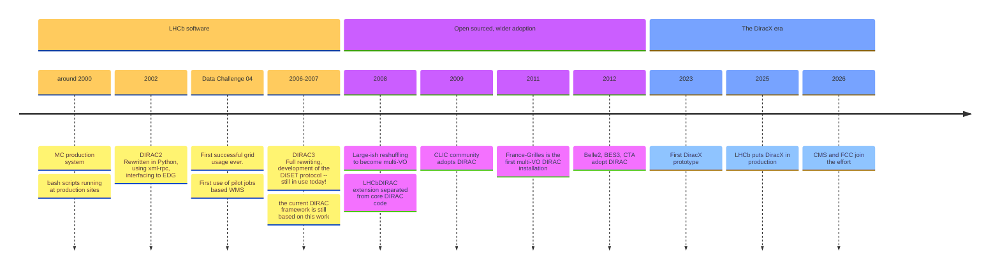
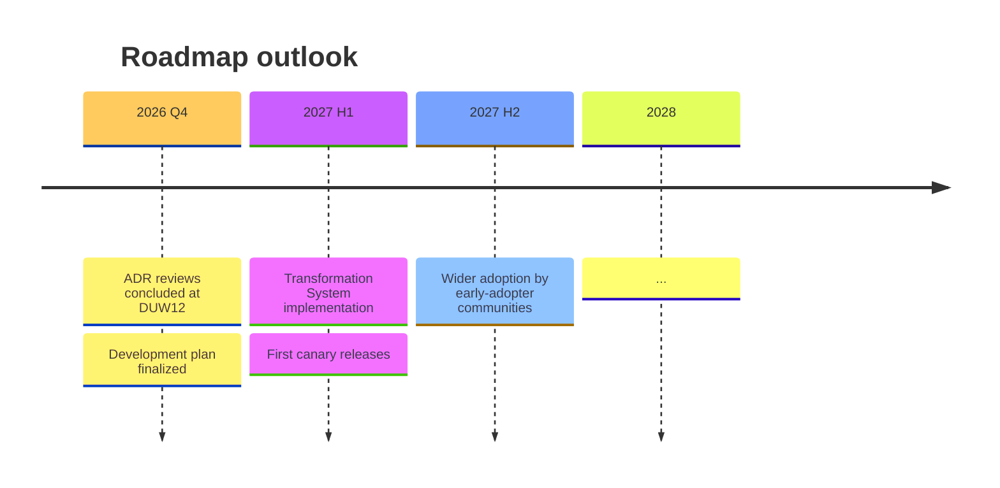

# The 12th Dirac(X) Users' Workshop
## DiracGrid, DiracX, and the Road Ahead

**Federico Stagni** <Email v="federico.stagni@cern.ch" />

DiracGrid Technical Coordinator

 

13–16 October 2026, FZU Prague

<a href="https://indico.cern.ch/event/1588323/" class="ns-c-iconlink"><mdi-open-in-new />indico.cern.ch/event/1588323</a>

---
layout: section
color: diracx
title: Monolith to Puzzle
---

# From the Monolith to the Puzzle

---
layout: top-title
color: diracx-light
align: cm
title: DiracGrid
---

:: title::

# The shortened Dirac's story

:: content ::

Timeline:

(full history in [this presentation](https://indico.cern.ch/event/1252369/contributions/5515343/attachments/))

Nowadays, the DiracGrid project develops/maintains DIRAC, DiracX, Web, etc... (everything in https://github.com/DIRACGrid).

[diracgrid.org](https://diracgrid.org) is hosting "everything" else you need.

 

Also the **logos changed**: we moved from the DIRAC branding to the new **DiracX** identity.

 </img>

---
layout: top-title
color: diracx-light
align: cm
title: 2026-pivotal
---

:: title ::

# 2026 is a pivotal year

:: content ::

- **CMS and FCC are joining the effort** – bringing new requirements, scale, and energy to the project
- **New development process adopted** since the beginning of 2026
  - SCRUM-based, with 2-week sprints and regular checkpoint meetings
- **ADRs for everything** – Architecture Design Records guide every major decision before code is written
  - Transparent, reviewable, community-driven design process
  - [DX-ADR series](https://github.com/DIRACGrid/diracx/pulls?q=is%3Apr+is%3Aopen+label%3AADR) covers Transformation System, compute backends, CWL, and more

---
layout: top-title-two-cols
color: diracx-light
align: c-lm-lm
title: disambiguation
columns: is-4
---

:: title ::

# "Just rewriting" vs "Rethink and write"

:: left ::

**Just rewriting**
- Port existing functionality line-by-line
- Same architecture, new language/framework
- Fast, but locks in past limitations

:: right ::

**Rethink and write** (our approach)
- Question every assumption from the ground up
- Cloud-native, multi-VO from the get-go, standards-based
- Slower upfront, but the result is **younger, faster, better, stronger**
- DiracX is not DIRAC in a new language — it's DIRAC reimagined

<AdmonitionType type='important' >
A DIRAC++, in terms of functionalities — not just a port.
</AdmonitionType>

---
layout: top-title
color: diracx-light
align: cm
title: strategies
---

:: title ::

# Migration strategies we use (and when)

:: content ::

| Strategy | What | When adopted | Why |
|----------|------|-------------|-----|
| **FutureAdaptors** | 1-to-1 service replacements | Early prototypes | Quick wins, but bound to old DB schema; partially adopted |
| **RSS strategy** | Replace subsystem by subsystem | Ongoing | Minimizes disruption, allows gradual validation |
| **Legacy DIRAC as a backend** | DIRAC WMS as a compute backend from TransformationSystem POV | Current design | Eases transition, reuses investment |
| **Canary releases** | Gradual replacement on specific workloads | As features mature | Low-risk, real-world validation before full rollout |

<AdmonitionType type='note' >
<strong>Migrating extension code?</strong> Start by identifying which strategy fits your use case. FutureAdaptors work for direct service replacements, but for larger rewrites, plan around the new ADR-driven architecture.
</AdmonitionType>

---
layout: top-title
color: diracx-light
align: cm
title: roadmap
---

:: title ::

# The new roadmap

:: content ::

**TBD** – This will be discussed and finalized during the workshop.

Key areas under consideration:
- Transformation System completion
- Data Management integration (Rucio or native)
- Pilot / WMS development
- Job wrapper design (CMS-proposed ADR?)
- User-facing interfaces (analysis productions)

---
layout: top-title
color: diracx-light
align: cm
title: game-changed
---

:: title ::

# How the game has changed

:: content ::

> "The bottleneck for software development has always been writing code. With AI, **the bottleneck is our imagination**."
> — Jonathan Heyne, COO of DeepLearning.AI ([The Register, Apr 2026](https://www.theregister.com/2026/04/28/software_development_ai_dev25xsf))

 

| Before | Now |
|--------|-----|
| Bottleneck: **not enough developers** | Bottleneck: **specifications** |
| Every line hand-crafted by experts | LLMs write most of the code |
| Slow progress, long backlogs | Good ADRs are the real multiplier |

<AdmonitionType type='important' >
The value is no longer in writing code — it's in <strong>knowing what code to write</strong>.
</AdmonitionType>

> "If I have to review the code, I become the bottleneck."
> — Andrew Ng, [AI Dev 26 x SF](https://www.theregister.com/2026/04/28/software_development_ai_dev25xsf)

---
layout: section
color: diracx-green
title: Numbers
---

# Numbers since the previous workshop

---
layout: top-title-two-cols
color: diracx-light
align: cm-lm-lm
title: numbers-dirac
columns: is-5
---

:: title ::

# DIRAC stack activity

:: left ::

<!-- TODO: Update with actual numbers from previous DUW -->

- **Commits / PRs:** TBD
- **Issues created:** TBD
- **Issues closed:** TBD
- **Contributors:** TBD

:: right ::

<!-- Reference: slides 20+21 from https://gitlab.cern.ch/alboyer/slides-computing-report-lhcb-week/-/raw/master/deck/20260915-LHCbWeek121-Compute.pdf -->

<AdmonitionType type='note' >
See [LHCb Computing Report slides 20-21](https://gitlab.cern.ch/alboyer/slides-computing-report-lhcb-week/-/raw/master/deck/20260915-LHCbWeek121-Compute.pdf) for detailed metrics.
</AdmonitionType>

---
layout: top-title-two-cols
color: diracx-light
align: cm-lm-lm
title: numbers-diracx
columns: is-5
---

:: title ::

# DiracX stack activity

:: left ::

<!-- TODO: Update with actual numbers from previous DUW -->

- **Commits / PRs:** TBD
- **Issues created:** TBD
- **Issues closed:** TBD
- **Contributors:** TBD

:: right ::

<AdmonitionType type='note' >
See [LHCb Computing Report slides 20-21](https://gitlab.cern.ch/alboyer/slides-computing-report-lhcb-week/-/raw/master/deck/20260915-LHCbWeek121-Compute.pdf) for detailed metrics.
</AdmonitionType>

---
layout: top-title
color: diracx-light
align: cm
title: releases
---

:: title ::

# Releases

:: content ::

**DIRAC v9**
- Regular releases continue
- Changelog: [github.com/DIRACGrid/DIRAC/releases](https://github.com/DIRACGrid/DIRAC/releases)

**DiracX**
- Ongoing development releases
- Changelog: [github.com/DIRACGrid/diracx/releases](https://github.com/DIRACGrid/diracx/releases)

---
layout: top-title
color: diracx-light
align: cm
title: v8-update
---

:: title ::

# Update process for v8 users

:: content ::

For v8 users still on the legacy stack:

- The only significant change is that **you should now target v9.0**
- v8 is in maintenance mode; new features go to v9 and DiracX
- Migration path is straightforward: update your dependencies and test against v9.0
- Contact the DiracGrid team if you need help with the transition

---
layout: top-title
color: diracx-light
align: cm
title: timeline-future
---

:: title ::

# Timeline (looking ahead)

:: content ::

<!-- TODO: Add future timeline once roadmap is finalized -->

---
layout: top-title
color: diracx-light
align: cm
title: hsf
---

:: title ::

# HSF Affiliated Project

:: content ::

 

DiracGrid is an [**HSF affiliated project**](https://hepsoftwarefoundation.org/projects/projects.html).

 

  

 

This affiliation recognizes DiracGrid's contribution to the HEP software ecosystem and ensures alignment with community-wide best practices.

---
layout: section
color: diracx-green
title: Publications
---

# Publications and Outreach

---
layout: top-title
color: diracx-light
align: cm
title: chep-papers
---

:: title ::

# CHEP papers

:: content ::

<!-- TODO: Add CHEP paper references -->

- CHEP 2025 papers on DiracX architecture and deployment
- Links and DOIs to be added

---
layout: top-title
color: diracx-light
align: cm
title: other-conferences
---

:: title ::

# DiracX at other conferences

:: content ::

<!-- TODO: Add conference references -->

- DiracX presentations at various HEP computing conferences
- Community outreach and engagement

---
layout: section
color: diracx
title: Program
---

# Program of Work for These Days

---
layout: top-title
color: diracx-light
align: cm
title: program-details
---

:: title ::

# What we'll do together

:: content ::

<!-- TODO: Fill in with actual workshop program -->

- Review and finalize the ADRs
- Iron out the last details on the Transformation System design
- Prepare the development plan
- Code some of the tasks together
- Discuss migration strategies for each community

See the [full agenda](https://indico.cern.ch/event/1588323/timetable/) on Indico.

---
layout: section
color: diracx
title: Conclusions
---

# Summary

---
layout: top-title-two-cols
align: cm-cm-lm
color: diracx-light
columns: is-3
title: summary
---
:: title ::

# Summary

:: left ::

 </img>

:: right ::

- DiracGrid has a very active community of users and developers
- **2026 is a pivotal year**: CMS and FCC joined, new dev process, ADRs for everything
- DiracX is the **rethought** DIRAC — cloud-native, modular, standards-based
- Multiple migration strategies are available depending on your needs
- The **Transformation System** is the next big thing
- **Let's build it together** during this workshop

---
layout: credits
color: diracx
loop: true
speed: 1.4
title: credits/people
---

    

        <strong>People</strong> 
    

    

        <strong>Current Developers, maintainers, supporters (non-exhaustive list)</strong>
    

    

        Chris Burr <i>CERN, LHCb</i> 
        Christophe Haen <i>CERN, LHCb</i> 
        Alexandre Boyer <i>CERN, LHCb</i> 
        Natthan Pigoux <i>LUPM (FR), CTAO</i> 
        Cedric Serfon <i>Brookhaven National Laboratory (US), Belle2</i> 
        Ryunosuke O'Neil <i>CERN, LHCb</i> 
        Daniela Bauer <i>Imperial college (UK), GridPP</i> 
        Simon Fayer <i>Imperial college (UK), GridPP</i> 
        Janusz Martyniak <i>Imperial college (UK), GridPP</i> 
        Xiaomei Zhang <i>Beijing, Inst. High Energy Phys. (CN), Juno</i> 
        Luisa Arrabito <i>LUPM (FR), CTAO</i> 
        André Sailer <i>CERN, ILC</i> 
        Jorge Lisa Laborda <i>Univ. of Valencia and CSIC (ES), LHCb</i> 
        Bertrand Rigaud <i>IN2P3 (FR), France-Grilles</i> 
        Heloise Joffe <i>IN2P3 (FR), France-Grilles</i> 
        Stella Maria Renucci <i>LUPM (FR), CTAO</i> 
        Mazen Ezzeddine <i>CPPM (FR), EGI</i> 
        Loris Vankatwijk <i>LUPM (FR), CTAO</i> 
        Alan Malta <i>Notre Dame university (US), CMS</i> 
        Andrea Piccinelli <i>Notre Dame university (US), CMS</i> 
        Valentin Kuznetsov <i>Cornell University (US), CMS</i> 
        Marco Mascheroni <i>(US), University of California San Diego (US), CMS</i> 
        Todor Ivanov <i>Notre Dame university (US), CMS</i> 
        Francesco Brivio <i>(IT), Milano Bicocca University, CMS</i> 
        Juraj Smiesko <i>(CERN), FCC</i> 
        Benedikt Wach <i>(CERN), FCC</i> 
    

    

        <strong>Project lead</strong>
    

    

        Federico Stagni <i>CERN, LHCb</i> 
        Andrei Tsaregorodtsev <i>CPPM (FR), EGI, LHCb, Juno</i>
    

&nbsp;
&nbsp;
&nbsp;
---
layout: section
color: diracx
title: Questions
---

# Questions?
